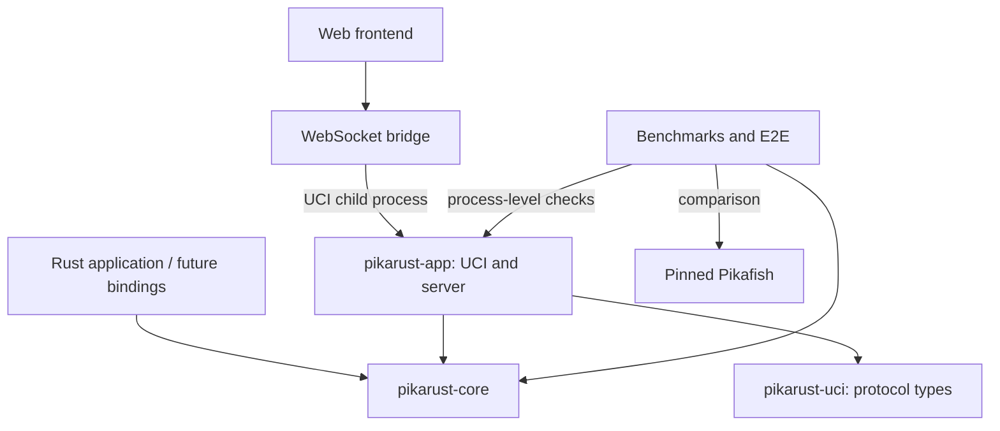

# Architecture

PikaRust separates the Xiangqi engine from the applications that run it. The
primary reusable component is `pikarust-core`; the native UCI program, server,
and web bridge provide different integration paths.

## Workspace components

| Component | Responsibility | Boundary |
| --- | --- | --- |
| `crates/pikarust-core` | Positions, rules, move generation, NNUE, search, engine API | No application transport or UI dependencies |
| `crates/uci-rs` (`pikarust-uci`) | UCI command parsing and response formatting | Independent protocol representation, imported as `uci_rs` |
| `crates/pikarust-app` | `pikarust` CLI and `pikarust-server` | Process I/O, configuration, sessions, HTTP/WebSocket adapters |
| `crates/pikarust-bench` | Perft and search benchmarks | Development and validation executable |
| `e2e_platform` | UCI process harness, reference comparison, match referee | Integration testing, not an engine dependency |
| `pikarust-web/bridge` | Launch a native UCI engine and serve browser requests | Child-process adapter |
| `pikarust-web/frontend` | Board, controls, history, analysis display | Browser presentation |

All Rust components participate in the root workspace and share one lockfile.
The frontend maintains its own npm lockfile. Directory renaming is not required
to establish these boundaries; crate dependencies define them.

## Engine layers

`types` defines squares, pieces, moves, and internal score types. `bitboard`
provides attacks and board operations. `position` owns FEN, legal move generation,
make/unmake state, repetition, and rule adjudication. These layers must remain
usable without starting a search or loading a neural network.

`nnue` owns model decoding, feature extraction, accumulators, layers, and SIMD
dispatch. Incremental evaluation must agree with a fresh evaluation of the same
position. The scalar implementation provides a numerical reference for the
architecture-specific kernels.

`search` owns iterative deepening, move ordering, quiescence search, transposition
tables, histories, time management, and worker coordination. Search heuristics
consume position and evaluation state; application transports do not participate
in the search recursion.

`engine` is the intended application facade. It owns options, current position,
model selection, and worker lifecycle. Applications submit search limits and
receive an owned result through a search handle. Search cancellation belongs to
this lifecycle and must remain effective when an application disconnects or
drops a handle.

Use `try_go` and `SearchHandle::wait_result` at application boundaries to retain
input-validation and worker-disconnection errors. Compatibility methods `go`
and `wait` remain available; a new integration should prefer the fallible API.

A clock is absent only when both entries in `SearchLimits::time` are `None`.
When either side supplies a clock, a zero or omitted clock for the side to move
uses a minimum 1 ms clock value. Depth, node, and move-time limits still apply
independently; an exhausted clock must not accidentally become an unlimited
search.

With panic unwinding enabled, a panicking search worker stops the search and
reports `EngineError::SearchFailed` through the fallible handle API. The workspace
release profile retains unwinding for this recovery path. An embedding application
that selects `panic = "abort"` instead terminates the process on panic. Recovery
does not establish that the underlying algorithm is free of defects.

## Embedding and model ownership

Use an explicit model path when an application requires NNUE:
`Engine::with_nnue_file(path)` returns an error if loading fails.
`Engine::with_network(Arc<Network>)` allows engine instances to share immutable
weights while retaining independent search state. `Engine::without_nnue()`
selects material-only evaluation deliberately.

`Engine::new()` retains compatibility with local model discovery. Because its
fallback depends on the working directory and available files, it is unsuitable
as proof that a benchmark or deployed service is using NNUE. Check `has_nnue()`
or use an explicit constructor.

Internal evaluation values and normalized UCI centipawns are different units.
Consumers should use the fields appropriate to their interface, preserve mate
score semantics, and avoid converting a mate into an ordinary numeric cp score.

## Application responsibilities

The native UCI executable translates protocol commands into engine operations
and keeps protocol output on stdout. Diagnostics belong on stderr or in explicit
UCI diagnostic messages. Unsupported operations must not appear to succeed.

The HTTP/WebSocket application manages pooled engines and sessions. It is an
experimental application adapter, not a complete hosted service: deployment
authentication, admission limits, resource isolation, and operational monitoring
are separate integration concerns.

The web UI uses a native process through the bridge. It is not a browser-native
WASM engine. The frontend may display or collect moves, but the engine remains
the authority on legality and search results.

The frontend inspects each position through the native engine:

| Command | Inspection contract |
| --- | --- |
| `position ...` | Load the FEN and complete move history |
| `go perft 1` | Root move divisions and `Nodes searched`, providing the legal moves |
| `eval` | Final evaluation or the explicit in-check marker |
| `d` | `Game status:` with `ongoing`, `draw`, `win`, or `loss` |
| `isready` | `readyok` marking completion of the inspection |

Wins and losses are relative to the side to move. Status includes the engine's
repetition, move-limit, material, and no-legal-move adjudication. The frontend
translates that result for the selected player; it does not maintain a second
implementation of those adjudication rules. A twofold repetition alone does not
end the game. Definitive rule judgments take precedence; otherwise, no legal
move is a loss, including stalemate. Incomplete diagnostic responses produce an
error rather than an inferred legal position.

Cancelling a search sends `stop` followed by `isready`. The native application
emits the stopped search's final `bestmove` before `readyok`; the frontend drains
that response before starting a replacement operation, so stale results cannot
be applied to a new game or an undone position.

This browser adapter targets the PikaRust executable and its diagnostic
extensions. Perft, evaluation, and game-status diagnostic formats are not a
portable UCI interface, so an arbitrary UCI engine is not a compatible
replacement without an adapter.

## Extension policy

Future Python, Node.js, C, or WASM integrations should use separate adapter
crates. Define stable data transfer types and explicit resource ownership there.
Keep runtime-specific dependencies and exception conversion out of core.
Native threads and filesystem-based model loading need an explicit design for
WASM; the presence of a Rust library does not establish browser compatibility.

Refactor at an existing boundary when it reduces coupling or makes an invariant
testable. Avoid mixing a broad module relocation with numerical changes to
search or NNUE. Preserve a reproducible comparison before replacing an algorithm,
and distinguish intentional divergence from incomplete upstream alignment.
